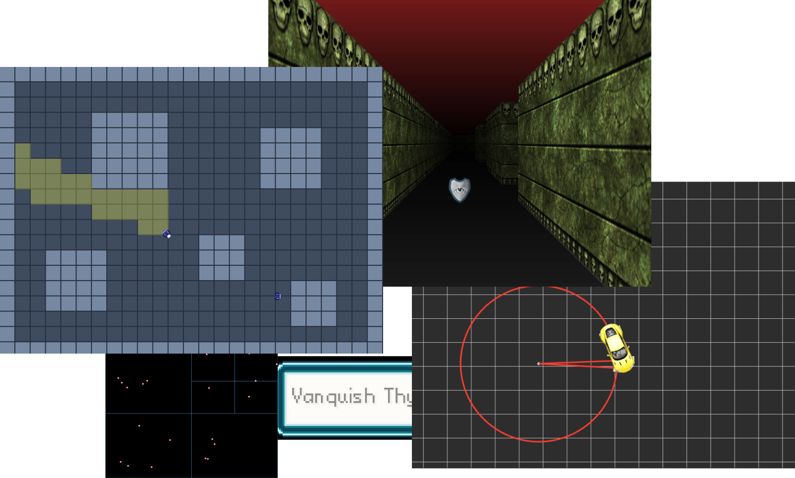

# Examples and minigames for PIXIJs and ECSLite library

## Live demo
- all examples can bee found live on the [official webpage](https://aphgames.io/docs/learning/examples/pixi-intro/animation)

## Docs
- documentation of the ECSLite library that is used for most examples can be found live [here](https://aphgames.io/docs/learning/tutorials/ecsdocs)

## How to run this project
- the project is powered by ParcelJS, TypeScript, PixiJS and ECSLite libraries
- install [NodeJS](https://nodejs.org/en/download/)
- execute `npm install`
- execute `npm run dev`
- go to `localhost:1234/index.html` to browse all examples

## Deployment
- run `npm run deploy` and find your project in the `build` folder