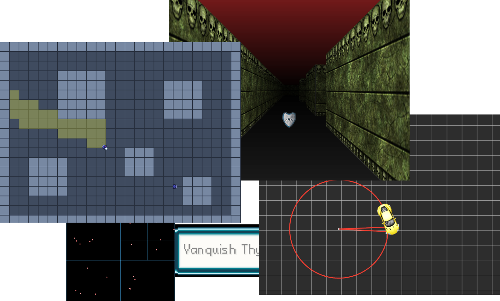

# Examples and minigames for PixiJS and Colfio

## Live demo
- all examples can be found live on the [official webpage](https://aphgames.io/docs/learning/examples/pixi-intro/animation)

## Docs
- library docs: [colf.io](https://colf.io) ([colfio](https://github.com/colfio/colfio) **0.4.0** / PixiJS 8)

## How to run this project
- powered by ParcelJS, TypeScript, PixiJS 8, and **colfio** from npm (`colfio@^0.4.0` — not linked to a sibling checkout)
- install [NodeJS](https://nodejs.org/en/download/) (Node >= 18)
- enable **pnpm** (this package uses pnpm, not npm): `corepack enable` or `npm i -g pnpm`
- in this folder, run `pnpm install`
- run `pnpm run generate-views` to generate HTML files from examples-info.json
- run `pnpm run dev` and open **http://localhost:1234/** (do not open `view/*.html` via Live Server or `file://` — bare imports like `pixi.js` only resolve through Parcel)

Do not mix `npm install` with an existing pnpm `node_modules` — if install fails after switching package managers, delete `node_modules` (and any `package-lock.json`) then run `pnpm install` again.

## Versioning
- examples package: **7.1.0**
- depends on [colfio 0.4.0](https://github.com/colfio/colfio/releases/tag/0.4.0) (`colfio@^0.4.0` on npm)

## Deployment
- run `pnpm run build` and find your project in the `build` folder
