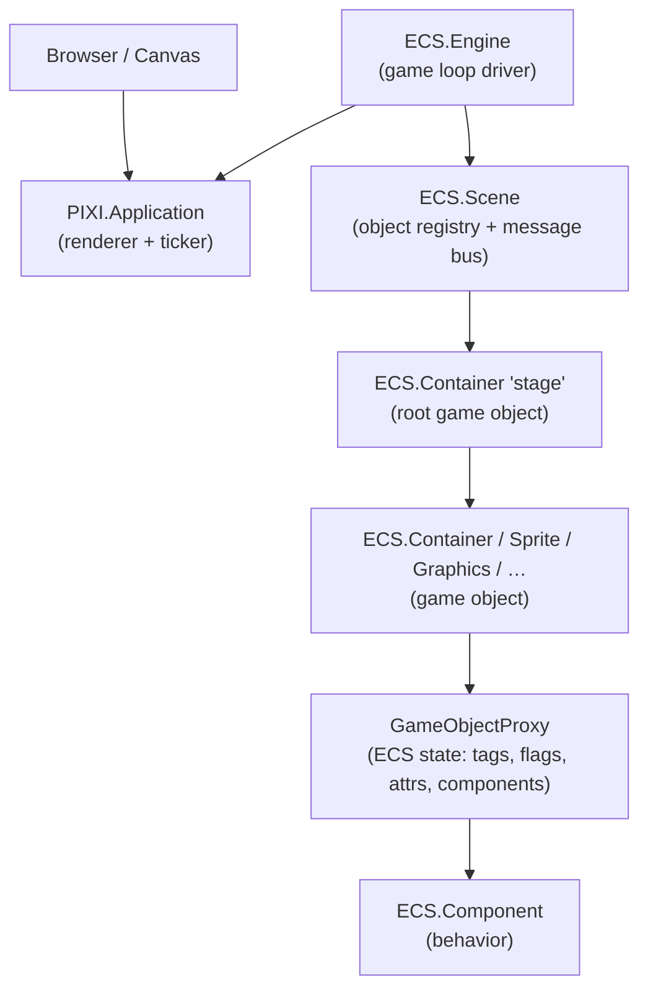
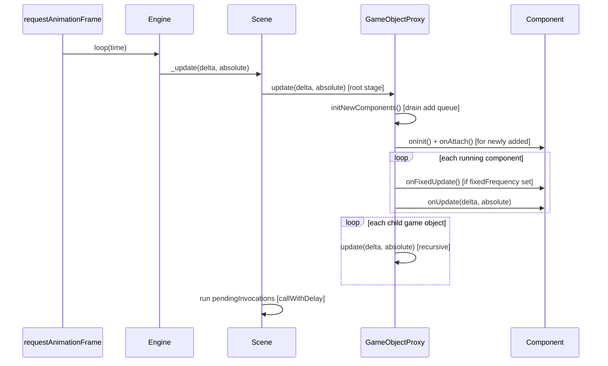
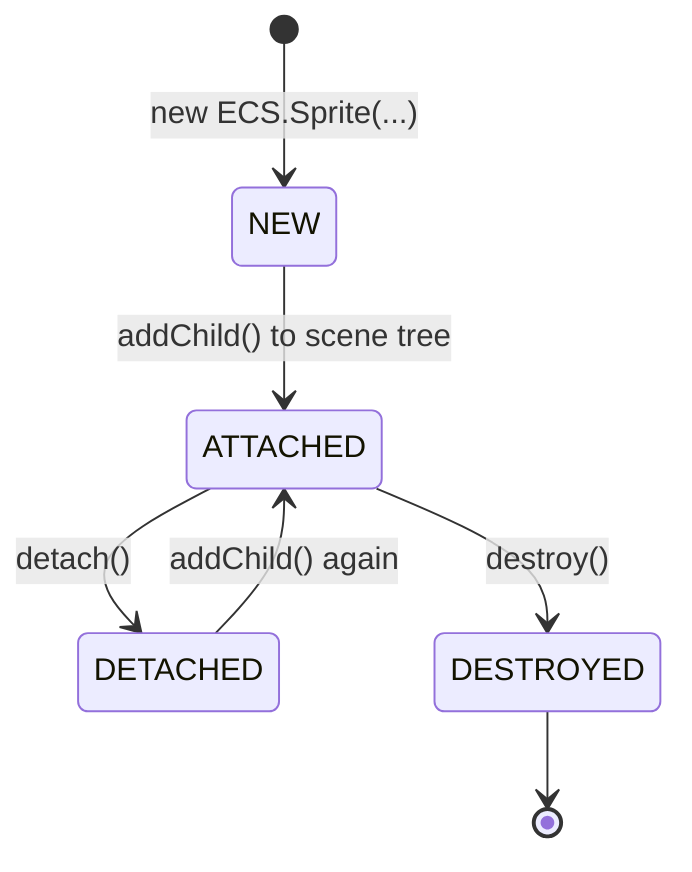

# Architecture

> **TL;DR**
> - COLFIO wraps PixiJS with an ECS (Entity-Component-System) layer
> - `Engine` → `Scene` → `Container/Sprite/…` → `Component` is the ownership chain
> - `GameObjectProxy` stores all ECS state so PIXI objects can stay clean
> - The update loop is depth-first recursive and driven by `requestAnimationFrame`
> - Component adds are **deferred** by default; messaging is a separate publish/subscribe channel

---

## Layer Diagram



---

## Core Classes

### `Engine` (`libs/pixi-ecs/engine/engine.ts`)

The entry point. It:

- Creates a `PIXI.Application` (renderer, canvas binding)
- Creates one `Scene` named `'default'`
- Stops PIXI's auto-ticker and drives the loop manually via `requestAnimationFrame`
- Calls `scene._update(delta, gameTime)` each frame
- Supports two loop modes: `FIXED` and `VARIABLE` (see [02-engine-setup.md](./02-engine-setup.md))

### `Scene` (`libs/pixi-ecs/engine/scene.ts`)

The object registry and message bus. It:

- Owns **`stage`**: a `Container` that replaces PIXI's default stage
- Maintains `Map<id, Container>` of all game objects
- Maintains optional indexed lookup maps (by name, tag, flag, state)
- Routes messages to subscribed components via `LookupMap<action, Component>`
- Runs **deferred invocations** (`callWithDelay`) at the end of each update

### `Container` / `Sprite` / `Graphics` / … (game objects)

Each game object class:

- Extends the corresponding **PIXI class** (`PIXI.Container`, `PIXI.Sprite`, etc.)
- Holds a **`_proxy: GameObjectProxy`** instance
- Delegates all ECS operations to the proxy (components, tags, attributes, flags, state)
- Overrides `addChild` / `removeChild` to propagate scene attach/detach to children

### `GameObjectProxy` (`libs/pixi-ecs/engine/game-object-proxy.ts`)

Stores all ECS runtime state for one game object:

- **`id`** — auto-incremented unique identifier
- **`stateId`** — single numeric state (used for indexed state queries)
- **`_tags`** — `Set<string>`
- **`flags`** — `Flags` (bit-array supporting indices 1–128)
- **`attributes`** — `Map<string, any>`
- **`components`** — `Map<id, Component>` (insertion-ordered)
- **`componentsToAdd`** — deferred add queue

### `Component<T>` (`libs/pixi-ecs/engine/component.ts`)

The behavior unit. Each component:

- Has **`owner: Container`** and **`scene: Scene`** set when initialized
- Has **`props: T`** — the typed data model passed via constructor
- Implements lifecycle hooks (see [03-components.md](./03-components.md))
- Can `subscribe`, `unsubscribe`, `sendMessage`, and `finish`

---

## PIXI–COLFIO Binding

COLFIO does not replace PIXI objects — it **extends** them:

```
ECS.Sprite ──extends──► PIXI.Sprite
ECS.Container ──extends──► PIXI.Container
ECS.Graphics ──extends──► PIXI.Graphics
```

This means:

- All PIXI rendering, animation, and display properties work unchanged
- You get ECS features (`addComponent`, `addTag`, etc.) on the same object
- You can add PIXI objects directly to `scene.stage` with `addChild`
- `GameObjectProxy` is used internally to avoid duplicated implementation across all wrapper types (JavaScript has no multiple inheritance)

---

## Update Loop

Each frame, `Engine` calls `scene._update(delta, absolute)`. The scene then calls `stage._proxy.update(delta, absolute)`, which recursively updates the entire scene tree depth-first:



**Update order facts:**

- Children update **after** their parent
- Components update in **insertion order** (Map iteration order)
- `callWithDelay(0, fn)` runs **after** the entire tree has updated
- There is no priority field — ordering is determined by add order

---

## Deferred Component Add

By default, `addComponent(cmp)` does **not** run the component immediately. It is placed in `componentsToAdd` and initialized at the **start** of the next `update` call for that game object:

```
addComponent(cmp)           → added to componentsToAdd queue
next frame update()         → initNewComponents() drains the queue
                            → onInit() called
                            → onAttach() called
                            → component starts receiving onUpdate / onMessage
```

To initialize a component **immediately** (same frame), use `addComponentAndRun(cmp)`. This requires the game object to already be on the scene.

---

## Object Attach / Detach / Destroy

Game objects go through distinct states:



- **Detach**: removes the object from the scene but does not destroy PIXI resources. Components enter `DETACHED` state and stop updating/receiving messages. The object can be re-attached later.
- **Destroy**: permanently removes the object, finalizes all components (`onRemove`), and destroys PIXI resources recursively through children.

When a parent is added to the scene tree, all its children are also attached recursively — their components are initialized in the same pass.

---

## Message Bus (overview)

The `Scene` maintains a `LookupMap<string, Component>` that maps message action keys to subscribed components. This is entirely separate from PIXI's event system:

- PIXI events: `sprite.on('click', handler)` — DOM-style, direct
- COLFIO messages: `this.subscribe('MY_ACTION')` → `this.sendMessage('MY_ACTION', data)` → `onMessage(msg)` called on all subscribers

See [05-messaging.md](./05-messaging.md) for the full reference.

---

## Key Design Decisions

| Decision | Rationale |
|----------|-----------|
| Component adds are deferred | Prevents mid-loop mutation of component collections |
| Search features are opt-in | Each indexed collection costs memory; disabled by default |
| `GameObjectProxy` delegation | Avoids code duplication across `Container`, `Sprite`, `Graphics`, etc. |
| Components can't receive their own messages | Prevents infinite feedback loops |
| `callWithDelay(0)` for end-of-frame | Safe way to clear/reload scene without corrupting update iteration |
| `stateId` is a single number | Simple, fast; use `flags` or `tags` when you need multiple concurrent states |
