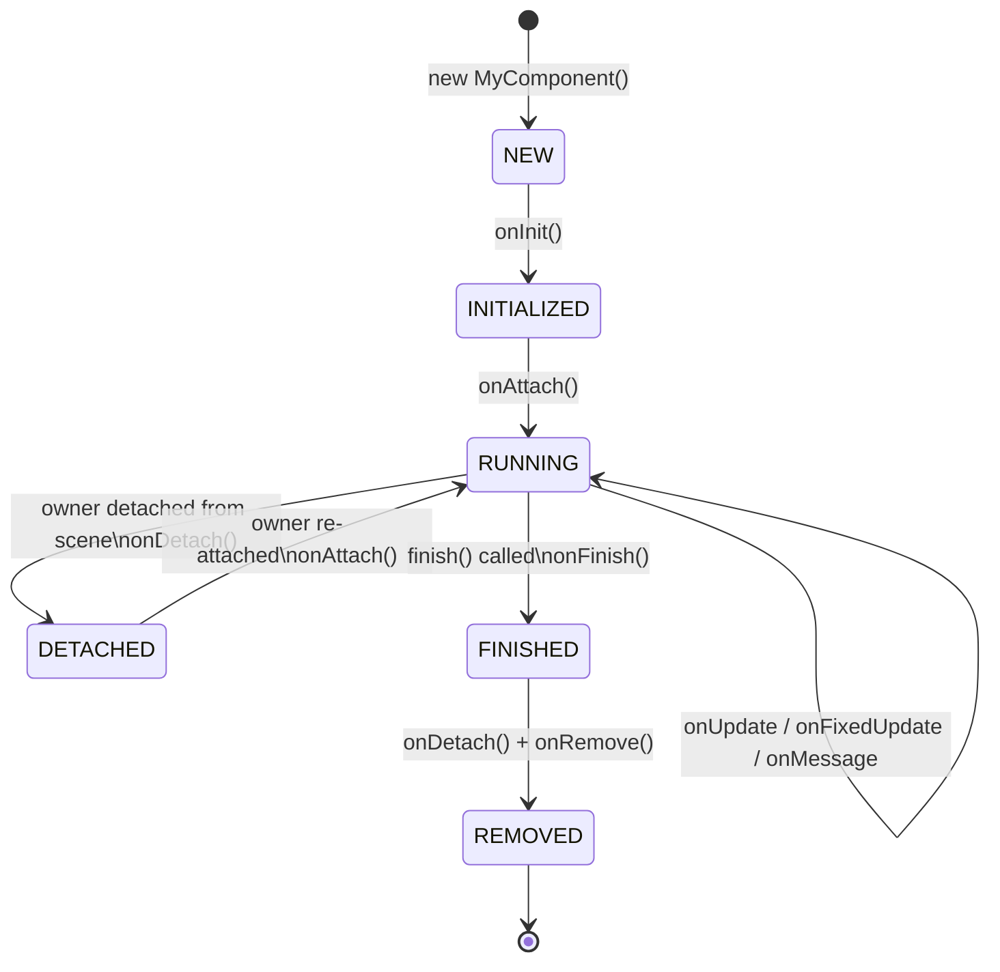

# Components

> **TL;DR**
> - `Component<T>` is the atomic behavior unit — one concern per component
> - Lifecycle: `onInit` → `onAttach` → `onUpdate` / `onFixedUpdate` / `onMessage` → `onDetach` → `onRemove`
> - Pass a typed model via `props: T` — never store global state inside components
> - `FuncComponent` is for simple inline behaviors; use class-based for anything complex
> - Call `finish()` to self-terminate; never manually delete a component

---

## The `Component<T>` Base Class

```typescript
// Generic signature
class Component<T = void> {
    id: number;               // auto-generated unique identifier
    name: string;             // component name (defaults to class name)
    owner: Container;         // game object this component is attached to
    scene: Scene;             // reference to the scene
    props: T;                 // typed data / model (set in constructor)
    fixedFrequency: number;   // Hz for onFixedUpdate; unset = never called
    cmpState: ComponentState; // NEW | INITIALIZED | RUNNING | DETACHED | FINISHED

    // Lifecycle hooks (override as needed)
    onInit(): void
    onAttach(): void
    onMessage(msg: Message): any | void
    onFixedUpdate(delta: number, absolute: number): void
    onUpdate(delta: number, absolute: number): void
    onDetach(): void
    onRemove(): void
    onFinish(): void

    // API
    subscribe(...actions: string[]): void
    unsubscribe(...actions: string[]): void
    sendMessage(action: string, data?: any, tagFilter?: string[]): Message
    finish(): void
}
```

---

## Lifecycle Reference



### `onInit()`

Called **once** when the component is first added to a game object. At this point `this.owner` and `this.scene` are set. Use this for:

- Subscribing to messages
- Setting `fixedFrequency`
- Reading initial state from `this.owner` or global attributes

```typescript
onInit() {
    this.subscribe(Messages.GAME_OVER, Messages.PLAYER_DIED);
    this.fixedFrequency = 5; // 5 updates per second
}
```

**Important**: Components added via `addComponent()` (deferred) are initialized at the **start of the next frame**. Use `addComponentAndRun()` to initialize immediately.

### `onAttach()`

Called when the component's owner game object is attached to the scene. This happens:

1. When a component is added to an object **already in the scene** (immediately after `onInit`)
2. When an object holding this component is **added to the scene** (e.g. `addChild`)
3. When a previously detached object is **re-attached**

If an object is detached and re-attached, `onAttach` fires again. Keep this idempotent or use `onInit` for one-time setup.

### `onUpdate(delta, absolute)`

Called every frame while the component is `RUNNING`.

- `delta` — milliseconds since last frame (variable loop) or fixed tick size (fixed loop)
- `absolute` — total game time in milliseconds since engine start

```typescript
onUpdate(delta: number, absolute: number) {
    this.owner.position.x += this.speed * (delta / 1000); // speed in px/s
}
```

### `onFixedUpdate(delta, absolute)`

Called at a fixed interval defined by `fixedFrequency` (Hz). Only invoked if `fixedFrequency` is set in `onInit`. Useful for game logic that should be decoupled from frame rate (AI decisions, physics steps, score ticks).

```typescript
onInit() {
    this.fixedFrequency = 3; // 3 decisions per second
}

onFixedUpdate(delta: number, absolute: number) {
    this.decideNextMove();
}
```

### `onMessage(msg)`

Called when a subscribed message arrives. The component must first call `this.subscribe(action)` to receive messages of that type.

```typescript
onInit() {
    this.subscribe(Messages.ENEMY_DIED);
}

onMessage(msg: ECS.Message) {
    if (msg.action === Messages.ENEMY_DIED) {
        this.score += 100;
        this.sendMessage(Messages.SCORE_CHANGED, this.score);
    }
}
```

Returning a value from `onMessage` adds it to `msg.responses` — useful for query-style messages.

### Component Reuse

A component can be **removed from one object and added to another**. This is safe — the component goes through `onDetach` / `onRemove` on the old object and a fresh `onInit` / `onAttach` on the new one. Only one object can own a component at a time.

```typescript
// Transfer a component between objects
const cmp = sourceObject.findComponentByName<MyComponent>(MyComponent.name);
sourceObject.removeComponent(cmp);
targetObject.addComponent(cmp); // fresh onInit + onAttach cycle
```

---

### `onDetach()`

Called when the owner object is detached from the scene (not destroyed). The component stops updating and receiving messages until re-attached.

### `onRemove()`

Called just before the component is permanently removed. Use for cleanup (removing event listeners, releasing resources). This is the "destructor" equivalent.

### `onFinish()`

Called just before `finish()` triggers the removal sequence (`onFinish` → `onDetach` → `onRemove`). Use for any final state saves or outbound messages.

---

## The Props Pattern (`Component<T>`)

The idiomatic way to give a component access to a data model is via the `props` field. Pass the model in the component's constructor call and type it with the generic parameter:

```typescript
// The model (plain TypeScript, no ECS dependency)
class GameModel {
    score = 0;
    lives = 3;
    level = 1;

    addScore(points: number) { this.score += points; }
    loseLife() { this.lives--; }
}

// The component, typed to the model
class ScoreDisplayComponent extends ECS.Component<GameModel> {

    onInit() {
        this.subscribe(Messages.SCORE_CHANGED);
    }

    onMessage(msg: ECS.Message) {
        if (msg.action === Messages.SCORE_CHANGED) {
            this.updateDisplay(this.props.score);
        }
    }

    private updateDisplay(score: number) {
        (this.owner as ECS.Text).text = `Score: ${score}`;
    }
}

// Usage in factory
const model = new GameModel();
new ECS.Builder(scene)
    .asText('Score: 0', myTextStyle)
    .withComponent(new ScoreDisplayComponent(model))
    .withParent(scene.stage)
    .build();
```

**Rules for props:**
- Model classes must be plain TypeScript — never extend `ECS.Component`
- The same model instance can be shared by multiple components
- Do not store mutable state **inside** components — put it in the model

---

## `FuncComponent` — Inline Behaviors

`FuncComponent` is a built-in component that wraps functions instead of requiring a new class. Use it for simple, disposable behaviors:

```typescript
// Animate alpha from 0 to 1 over 500ms
sprite.addComponent(
    new ECS.FuncComponent('fadeIn')
        .setDuration(500)
        .doOnUpdate((cmp, delta, absolute) => {
            sprite.alpha = Math.min(1, (absolute - startTime) / 500);
        })
        .doOnRemove(() => {
            sprite.alpha = 1;
        })
);
```

### `FuncComponent` API

| Method | Description |
|--------|-------------|
| `doOnInit(fn)` | Runs on `onInit` |
| `doOnAttach(fn)` | Runs on `onAttach` |
| `doOnUpdate(fn)` | Runs every frame |
| `doOnFixedUpdate(fn)` | Runs at fixed rate (set `setFixedFrequency` first) |
| `doOnMessage(action, fn)` | Handles a specific message action (auto-subscribes) |
| `doOnMessageOnce(action, fn)` | Handles once, then unsubscribes |
| `doOnMessageConditional(action, condition, fn)` | Handles when `QueryCondition` matches |
| `doOnDetach(fn)` | Runs on detach |
| `doOnRemove(fn)` | Runs on removal |
| `doOnFinish(fn)` | Runs on finish |
| `setFixedFrequency(hz)` | Sets fixed update rate |
| `setDuration(ms)` | Auto-finishes after given duration |

```typescript
// Example: a temporary blinking effect for 2 seconds
new ECS.FuncComponent('blink')
    .setDuration(2000)
    .setFixedFrequency(10)
    .doOnFixedUpdate((cmp) => {
        cmp.owner.visible = !cmp.owner.visible;
    })
    .doOnRemove((cmp) => {
        cmp.owner.visible = true; // restore on cleanup
    });
```

---

## Class-Based vs FuncComponent

| Use class-based when… | Use FuncComponent when… |
|-----------------------|------------------------|
| The behavior has complex internal state | The behavior is a simple function |
| Multiple lifecycle hooks are needed | Only `onUpdate` or one `onMessage` is needed |
| The component is reused across game objects | It's a one-off, inline behavior |
| You need inheritance (e.g. `BaseController → KeyboardController`) | No inheritance needed |
| Props typing is important | Typing is not needed |

---

## `finish()` — Self-Termination

Call `finish()` when a component has completed its job and should be removed:

```typescript
onMessage(msg: ECS.Message) {
    if (msg.action === Messages.GAME_OVER) {
        this.finish(); // stops updates, calls onFinish → onDetach → onRemove
    }
}
```

After `finish()`:
- The component will not receive any more `onUpdate` or `onMessage` calls
- It is removed from its owner immediately
- `onFinish()`, `onDetach()`, and `onRemove()` are called in sequence

**Never** call `removeComponent()` on yourself from inside a component — always use `finish()`.

---

## Global Components

Global components are attached to `scene.stage` — the root object. They are always active regardless of which game objects exist. Use them for cross-cutting concerns:

```typescript
// Add globally (runs on stage)
scene.addGlobalComponent(new ECS.KeyInputComponent());
scene.addGlobalComponentAndRun(new SoundManager());

// Retrieve by class name
const keys = scene.findGlobalComponentByName<ECS.KeyInputComponent>(ECS.KeyInputComponent.name);
```

**Pattern**: Store the component reference in a global attribute for easy retrieval:

```typescript
const keyInput = new ECS.KeyInputComponent();
scene.addGlobalComponentAndRun(keyInput);
scene.assignGlobalAttribute('key_input', keyInput);

// In any other component:
const keys = this.scene.getGlobalAttribute<ECS.KeyInputComponent>('key_input');
```

---

## Timing Reference

| Method | `delta` parameter | Invocation condition |
|--------|------------------|---------------------|
| `onUpdate` | ms since last frame | Every frame, always |
| `onFixedUpdate` | `1000 / fixedFrequency` | Every `1000 / fixedFrequency` ms |

`absolute` in both methods is the total game time elapsed since engine start in milliseconds. Use `this.scene.currentAbsolute` from outside an update call to get the same value.
