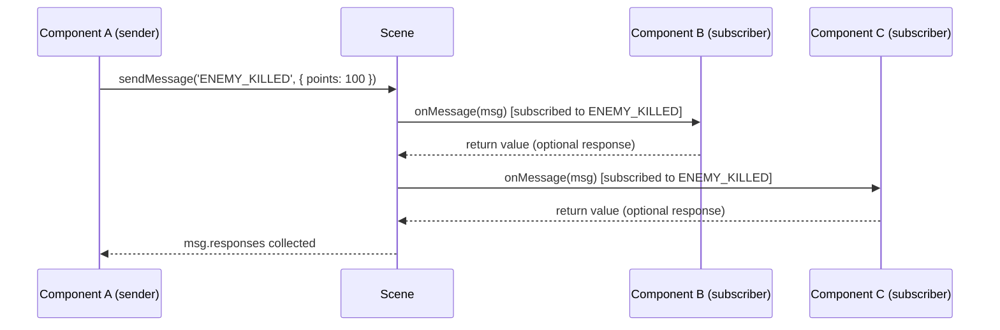

# Messaging

> **TL;DR**
> - The message bus is the only sanctioned way for components to communicate
> - `this.subscribe(action)` in `onInit`; handle in `onMessage(msg)`
> - `this.sendMessage(action, data?)` broadcasts to all subscribers
> - Components never receive their own messages
> - All message action keys must be `enum` values — never raw strings
> - Set `msg.expired = true` to stop propagation to further subscribers

---

## Overview

The COLFIO messaging system is a publish/subscribe channel that is entirely separate from PIXI's DOM-style events. It is the standard way for components to communicate without holding direct references to each other.



---

## The `Message` Object

```typescript
class Message {
    action: string;              // message type key (e.g. 'GAME_OVER')
    component: Component;        // the component that sent it (null if from scene)
    gameObject: Container;       // the owner of the sending component
    data: any;                   // arbitrary payload
    expired: boolean;            // set to true to stop propagation
    responses: MessageResponses; // collects return values from handlers
}
```

### Response Collection

If a handler returns a value from `onMessage`, it is stored in `msg.responses`:

```typescript
// Handler that returns a value
onMessage(msg: ECS.Message) {
    if (msg.action === Messages.QUERY_HEALTH) {
        return this.health; // added to msg.responses
    }
}

// Sender inspects responses
const msg = this.sendMessage(Messages.QUERY_HEALTH);
const responses = msg.responses.responses; // MessageResponse[]
if (msg.responses.isProcessed()) {
    const health = responses[0].data as number;
}
```

---

## Subscribe and Unsubscribe

### Subscribing

Call `this.subscribe(action)` inside `onInit`. The component will receive `onMessage` calls for that action key until it unsubscribes or is removed:

```typescript
onInit() {
    this.subscribe(Messages.GAME_OVER);
    this.subscribe(Messages.LEVEL_UP);
    this.subscribe(Messages.PLAYER_DIED);
}
```

Multiple actions can be subscribed in one call:

```typescript
this.subscribe(Messages.GAME_OVER, Messages.LEVEL_UP, Messages.PLAYER_DIED);
```

### Unsubscribing

Components are automatically unsubscribed when they are detached or removed. Manual unsubscribe is useful when you want to stop receiving a message while still running:

```typescript
onMessage(msg: ECS.Message) {
    if (msg.action === Messages.GAME_STARTED) {
        this.unsubscribe(Messages.GAME_STARTED); // listen only once
        this.startGame();
    }
}
```

---

## Sending Messages

### From a Component

```typescript
// Simple notification
this.sendMessage(Messages.PLAYER_DIED);

// With payload
this.sendMessage(Messages.SCORE_CHANGED, { score: 1500 });

// With tag filter — only delivered to components whose owner has this tag
this.sendMessage(Messages.HIT, { damage: 10 }, ['enemy']);
```

### From Outside a Component (scene-level)

```typescript
// When sending from a factory, loader, or any non-component code
scene.sendMessage(new ECS.Message(Messages.GAME_STARTED, null, null, levelData));
```

### Tag Filter

The optional third parameter of `sendMessage` is an array of tags. The message is only delivered to subscribers whose **owner game object** has at least one of those tags:

```typescript
// Only 'enemy' game objects receive this message
this.sendMessage(Messages.TAKE_DAMAGE, { amount: 25 }, ['enemy']);
```

---

## Stopping Propagation

Set `msg.expired = true` in a handler to prevent the message from reaching further subscribers:

```typescript
onMessage(msg: ECS.Message) {
    if (msg.action === Messages.PICK_UP_ITEM) {
        if (this.canPickUp(msg.gameObject)) {
            this.addToInventory(msg.data);
            msg.expired = true; // no other handler should process this pick-up
        }
    }
}
```

---

## Built-in Messages

The `ECS.Messages` enum contains all system-level messages. Most require specific `SceneConfig` options to be enabled.

| Action | Trigger | Data type | Config required |
|--------|---------|-----------|----------------|
| `Messages.ANY` | Every message (debug use) | original `msg` | — |
| `Messages.OBJECT_ADDED` | Game object added to scene | `Container` (via `msg.gameObject`) | — |
| `Messages.OBJECT_REMOVED` | Game object destroyed | `Container` (via `msg.gameObject`) | — |
| `Messages.COMPONENT_ADDED` | Component added to an object | `Component` (via `msg.component`) | — |
| `Messages.COMPONENT_DETACHED` | Component's owner detached | `Component` (via `msg.component`) | — |
| `Messages.COMPONENT_REMOVED` | Component removed | `Component` (via `msg.component`) | — |
| `Messages.ATTRIBUTE_ADDED` | Attribute added | `AttributeChangeMessage` | `notifyAttributeChanges: true` |
| `Messages.ATTRIBUTE_CHANGED` | Attribute value changed | `AttributeChangeMessage` | `notifyAttributeChanges: true` |
| `Messages.ATTRIBUTE_REMOVED` | Attribute removed | `AttributeChangeMessage` | `notifyAttributeChanges: true` |
| `Messages.STATE_CHANGED` | `stateId` changed | `StateChangeMessage` | `notifyStateChanges: true` |
| `Messages.FLAG_CHANGED` | Flag set or reset | `FlagChangeMessage` | `notifyFlagChanges: true` |
| `Messages.TAG_ADDED` | Tag added to object | `TagChangeMessage` | `notifyTagChanges: true` |
| `Messages.TAG_REMOVED` | Tag removed from object | `TagChangeMessage` | `notifyTagChanges: true` |
| `Messages.SCENE_CLEAR` | `clearScene()` called | `string` (scene name) | — |

### Listening for `OBJECT_ADDED`

Useful for collecting dynamically spawned objects into a list:

```typescript
onInit() {
    this.subscribe(ECS.Messages.OBJECT_ADDED);
}

onMessage(msg: ECS.Message) {
    if (msg.action === ECS.Messages.OBJECT_ADDED && msg.gameObject.hasTag('enemy')) {
        this.enemies.push(msg.gameObject);
    }
}
```

---

## Defining Game Messages

Always define game-specific messages as a TypeScript enum. Never use raw string literals:

```typescript
// constants.ts
export enum Messages {
    // Game events
    GAME_STARTED      = 'GAME_STARTED',
    GAME_OVER         = 'GAME_OVER',
    LEVEL_COMPLETED   = 'LEVEL_COMPLETED',
    LEVEL_UP          = 'LEVEL_UP',

    // Player events
    PLAYER_DIED       = 'PLAYER_DIED',
    PLAYER_RESPAWNED  = 'PLAYER_RESPAWNED',

    // State changes
    SCORE_CHANGED     = 'SCORE_CHANGED',
    HEALTH_CHANGED    = 'HEALTH_CHANGED',

    // UI controls
    CONTROLLER_BLOCK  = 'CONTROLLER_BLOCK',
    CONTROLLER_RUN    = 'CONTROLLER_RUN',
}
```

**Naming convention**:
- `GAME_*` — broad game lifecycle events
- `LEVEL_*` — level-specific events
- `PLAYER_*` — player actions and state
- `STATE_CHANGE_*` — mutable state change notifications
- `CONTROLLER_*` — input control events (block / unblock)

---

## Common Patterns

### Pattern 1: State lock/unlock

```typescript
// Game controller subscribes to block/unblock commands
onInit() {
    this.subscribe(Messages.CONTROLLER_BLOCK, Messages.CONTROLLER_RUN);
}

onMessage(msg: ECS.Message) {
    if (msg.action === Messages.CONTROLLER_BLOCK) this.paused = true;
    if (msg.action === Messages.CONTROLLER_RUN)   this.paused = false;
}

onUpdate(delta: number, absolute: number) {
    if (this.paused) return;
    // process input...
}
```

### Pattern 2: Sound component reacting to game events

```typescript
class SoundComponent extends ECS.Component {
    onInit() {
        this.subscribe(
            Messages.PLAYER_DIED,
            Messages.LEVEL_UP,
            Messages.SCORE_CHANGED,
        );
    }

    onMessage(msg: ECS.Message) {
        switch (msg.action) {
            case Messages.PLAYER_DIED:    PIXISound.play(Sounds.DEATH); break;
            case Messages.LEVEL_UP:       PIXISound.play(Sounds.LEVELUP); break;
            case Messages.SCORE_CHANGED:  PIXISound.play(Sounds.SCORE); break;
        }
    }
}
```

### Pattern 3: Renderer reacting to state changes

```typescript
class GameRenderer extends ECS.Component<GameModel> {
    onInit() {
        this.subscribe(
            Messages.SCORE_CHANGED,
            Messages.LEVEL_UP,
            Messages.GAME_OVER,
        );
    }

    onMessage(msg: ECS.Message) {
        if (msg.action === Messages.SCORE_CHANGED) {
            this.drawScore(this.props.score);
        }
        if (msg.action === Messages.GAME_OVER) {
            this.drawGameOverScreen();
        }
    }
}
```

### Pattern 4: Observable state (Vlak pattern)

Model objects can send messages directly via `scene.sendMessage`, making them observable without coupling to specific components:

```typescript
class TrainState {
    private scene: ECS.Scene;

    crashTrain() {
        this._crashed = true;
        this.scene.sendMessage(
            new ECS.Message(Messages.STATE_CHANGE_TRAIN_CRASHED, null, null)
        );
    }
}
```

Any component subscribed to `STATE_CHANGE_TRAIN_CRASHED` will react automatically.
