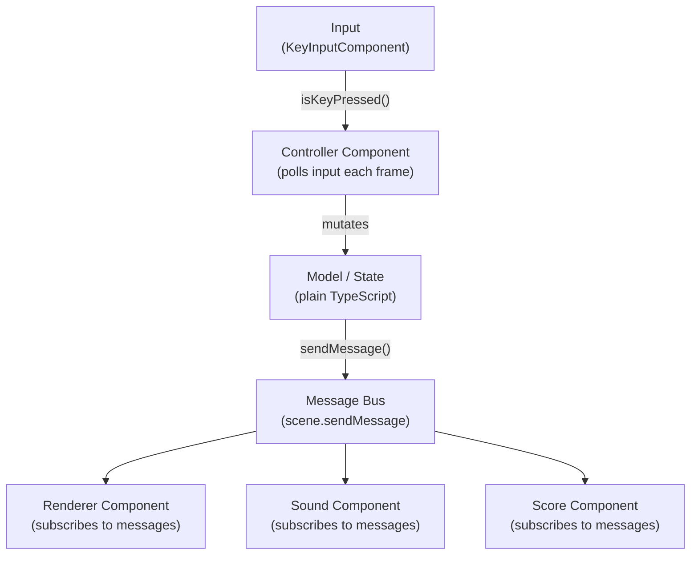

# Game Architecture

> **TL;DR**
> - Every game follows a consistent folder structure: `index / constants / factory / builders / selectors / actions / helpers / model / components`
> - The model layer is pure TypeScript — no ECS dependencies
> - `Factory` owns scene transitions; `Builders` owns entity construction; `Actions` owns multi-step sequences
> - `Selectors` wraps all global attribute access to avoid scattered raw strings
> - Data flows: Input → Controller → Model mutation → `sendMessage` → Renderer / Sound

---

## Canonical Folder Structure

```
src/game_mygame/
  index.ts              # Entry point, extends ECSExample, loads assets
  constants.ts          # All enums: Assets, Messages, Tags, Attributes, Flags
  factory.ts            # Scene-level transitions (loadIntro, loadGame, loadLevel)
  builders.ts           # ECS.Builder factory functions for each entity type
  selectors.ts          # Type-safe wrappers around getGlobalAttribute
  actions.ts            # ChainComponent factory functions for complex sequences
  helpers.ts            # Pure utility functions (no ECS dependency)
  model/
    game-structs.ts     # Immutable data types (interfaces, type aliases)
    game-state.ts       # Mutable state classes (may send messages on mutation)
  components/
    player-controller.ts   # Input polling + model mutation
    game-renderer.ts       # Message subscriber that redraws visuals
    sound-component.ts     # Message subscriber that plays sounds
    score-counter.ts       # Score tracking via message subscription
  animators/               # (optional) Components that animate and call finish()
    explosion-animator.ts
  loaders/                 # (optional) Level/data parsing
    level-parser.ts
    level-factory.ts
```

---

## Layer Diagram



**Key principle**: Controllers never call renderer methods directly. The only channel between controller and renderer is the message bus.

---

## Layer Descriptions

### `index.ts` — Entry Point

Extends `ECSExample` (the base class for all examples). Responsibilities:

- Configure engine dimensions and resolution
- Load all assets via `engine.app.loader`
- Hand off to `Factory` once assets are ready
- Handle resize for pixel-art scaling

```typescript
export class MyGame extends ECSExample {
    load() {
        PIXI.settings.SCALE_MODE = PIXI.SCALE_MODES.NEAREST;

        this.engine.app.loader
            .add(Assets.SPRITESHEET, `${getBaseUrl()}/assets/game_mygame/sprites.png`)
            .add(Assets.LEVELS, `${getBaseUrl()}/assets/game_mygame/levels.json`)
            .load(() => new Factory().loadIntro(this.engine.scene));
    }
}
```

### `constants.ts` — All Enums

One file for all string constants used across the game. Grouping them prevents typos and makes refactoring easy:

```typescript
export enum Assets {
    SPRITESHEET = 'spritesheet',
    MUSIC = 'music',
}

export enum Messages {
    GAME_OVER       = 'GAME_OVER',
    LEVEL_COMPLETED = 'LEVEL_COMPLETED',
    SCORE_CHANGED   = 'SCORE_CHANGED',
    PLAYER_DIED     = 'PLAYER_DIED',
}

export enum Tags {
    PLAYER  = 'player',
    ENEMY   = 'enemy',
    BULLET  = 'bullet',
    PICKUP  = 'pickup',
}

export enum Attributes {
    GAME_STATE = 'GAME_STATE',
    KEY_INPUT  = 'KEY_INPUT',
}

export const enum FLAGS {
    COLLIDABLE = 1,
    INVINCIBLE = 2,
}

export const GAME_CONFIG = {
    playerSpeed: 150,
    enemySpawnRate: 2000,
    maxLives: 3,
};
```

### `factory.ts` — Scene Transitions

Manages transitions between major game states. Each method:

1. Calls `scene.clearScene()` to reset
2. Sets up global infrastructure (key input, shared state)
3. Delegates entity creation to `Builders`

```typescript
export class Factory {
    loadIntro(scene: ECS.Scene) {
        scene.clearScene();
        this.setupGlobals(scene);
        scene.addGlobalComponentAndRun(new IntroComponent());
    }

    loadGame(scene: ECS.Scene, level = 0) {
        scene.clearScene();
        this.setupGlobals(scene);

        const state = new GameState(level);
        scene.assignGlobalAttribute(Attributes.GAME_STATE, state);

        scene.addGlobalComponentAndRun(new PlayerController(state));
        scene.addGlobalComponentAndRun(new GameRenderer(state));
        scene.addGlobalComponentAndRun(new SoundComponent());
        scene.addGlobalComponentAndRun(new ScoreCounter(state));
    }

    private setupGlobals(scene: ECS.Scene) {
        const keyInput = new ECS.KeyInputComponent();
        scene.addGlobalComponentAndRun(keyInput);
        scene.assignGlobalAttribute(Attributes.KEY_INPUT, keyInput);
    }
}
```

### `builders.ts` — Entity Construction

Returns `ECS.Builder` instances (not built objects) — the caller decides when to call `.build()`. This allows builders to be composed and reused:

```typescript
export class Builders {
    static playerBuilder = (scene: ECS.Scene, state: GameState) => {
        return new ECS.Builder(scene)
            .withName('player')
            .asSprite(PIXI.Texture.from(Assets.SPRITESHEET))
            .anchor(0.5)
            .localPos(state.spawnX, state.spawnY)
            .withTag(Tags.PLAYER)
            .withFlag(FLAGS.COLLIDABLE)
            .withComponent(new PlayerSyncComponent(state.playerState))
            .withParent(scene.stage);
    }

    static enemyBuilder = (scene: ECS.Scene, pos: { x: number, y: number }) => {
        return new ECS.Builder(scene)
            .asSprite(PIXI.Texture.from(Assets.ENEMY))
            .anchor(0.5)
            .localPos(pos.x, pos.y)
            .withTag(Tags.ENEMY)
            .withFlag(FLAGS.COLLIDABLE)
            .withComponent(new EnemyAI())
            .withParent(scene.stage);
    }
}

// Usage in factory or actions:
Builders.playerBuilder(scene, state).build();
```

### `selectors.ts` — Typed Global Attribute Access

Centralizes all calls to `getGlobalAttribute`. Prevents raw string keys from proliferating across the codebase:

```typescript
export class Selectors {
    static gameState = (scene: ECS.Scene): GameState =>
        scene.getGlobalAttribute<GameState>(Attributes.GAME_STATE);

    static keyInput = (scene: ECS.Scene): ECS.KeyInputComponent =>
        scene.getGlobalAttribute<ECS.KeyInputComponent>(Attributes.KEY_INPUT);
}

// Usage anywhere:
const state = Selectors.gameState(this.scene);
const keys  = Selectors.keyInput(this.scene);
```

### `actions.ts` — Multi-Step Sequences

Returns `ChainComponent` instances for complex async flows. Never contains direct PIXI manipulation — that belongs in components:

```typescript
export class Actions {
    static gameOver = (scene: ECS.Scene) => {
        return new ECS.ChainComponent()
            .call((cmp) => cmp.sendMessage(Messages.GAME_OVER))
            .waitTime(2000)
            .waitFor(() => new FadeOutAnimation())
            .call(() => scene.callWithDelay(0, () => new Factory().loadIntro(scene)));
    }

    static spawnEnemy = (scene: ECS.Scene, pos: { x: number, y: number }) => {
        return new ECS.ChainComponent()
            .call(() => Builders.enemyBuilder(scene, pos).build());
    }
}
```

### `helpers.ts` — Pure Utilities

No ECS imports. Pure functions for game math, transformations, and data manipulation:

```typescript
export const gridToWorld = (col: number, row: number, tileSize: number) => ({
    x: col * tileSize,
    y: row * tileSize,
});

export const isOppositeDirection = (a: Direction, b: Direction): boolean => {
    return (a === Direction.LEFT && b === Direction.RIGHT) ||
           (a === Direction.RIGHT && b === Direction.LEFT) ||
           (a === Direction.UP && b === Direction.DOWN) ||
           (a === Direction.DOWN && b === Direction.UP);
};
```

### `model/` — Data Layer

Two sub-files:

**`game-structs.ts`** — Plain TypeScript types, no ECS:

```typescript
// Immutable data shapes
export interface LevelData {
    readonly name: string;
    readonly width: number;
    readonly height: number;
    readonly tiles: TileType[][];
}

export type MapPosition = {
    column: number;
    row: number;
    direction: Direction;
};

export enum Direction { UP = 'UP', DOWN = 'DOWN', LEFT = 'LEFT', RIGHT = 'RIGHT' }
```

**`game-state.ts`** — Mutable state that can notify:

```typescript
export class GameState {
    private _score = 0;
    private _lives = 3;
    private scene: ECS.Scene;

    constructor(scene: ECS.Scene) {
        this.scene = scene;
    }

    addScore(points: number) {
        this._score += points;
        this.scene.sendMessage(
            new ECS.Message(Messages.SCORE_CHANGED, null, null, this._score)
        );
    }

    loseLife() {
        this._lives--;
        if (this._lives <= 0) {
            this.scene.sendMessage(new ECS.Message(Messages.GAME_OVER, null, null));
        }
    }

    get score() { return this._score; }
    get lives() { return this._lives; }
}
```

### `components/` — Behavior Units

Each component has exactly one job:

| Component | Job |
|-----------|-----|
| `PlayerController` | Poll key input, mutate player state |
| `GameRenderer` | Subscribe to messages, redraw game grid or sprites |
| `SoundComponent` | Subscribe to game events, play audio |
| `ScoreCounter` | Track and display score |
| `EnemyAI` | Enemy decision logic (fixed update) |
| `SpawnManager` | Spawn enemies at intervals (fixed update) |
| `CollisionDetector` | Check overlaps, send collision messages |

---

## Global Components vs Scene Components

| Type | Attached to | Used for |
|------|-------------|---------|
| Global component | `scene.stage` | Input, sound, score, AI managers — always active |
| Scene component | A specific game object | Movement, rendering, animation — tied to one entity |

Add global components with `scene.addGlobalComponentAndRun(cmp)`. They persist for the lifetime of the scene regardless of what game objects exist.

---

## `addGlobalComponentAndRun` vs `stage.addChild`

| Use | When |
|-----|------|
| `scene.addGlobalComponentAndRun(cmp)` | For logic-only components (no visual) — input, sound, game loop |
| `new ECS.Builder(scene).withParent(scene.stage).build()` | For visible game objects added to the root of the scene |

---

## Scene Transition Pattern

Never clear the scene from within a component's update loop. Always defer:

```typescript
// Wrong — crashes during update loop
scene.clearScene(); // throws Error

// Correct — deferred to end of frame
scene.callWithDelay(0, () => {
    scene.clearScene();
    new Factory().loadNextLevel(scene);
});

// Or from a ChainComponent (automatically safe in .call())
new ECS.ChainComponent()
    .waitTime(1000)
    .call(() => scene.callWithDelay(0, () => new Factory().loadGame(scene)));
```

---

## Sync Component Pattern

When game state is managed separately from visuals (e.g. a grid model vs sprite positions), create a dedicated sync component that reads state and updates the display:

```typescript
class RailcarSyncComponent extends ECS.Component<CarState> {
    onUpdate(delta: number, absolute: number) {
        // Keep sprite position in sync with the authoritative state
        this.owner.position.set(
            this.props.position.column * SPRITE_SIZE,
            this.props.position.row * SPRITE_SIZE
        );
    }
}
```

This pattern decouples movement logic (in state) from display updates (in sync component), making both testable independently.
