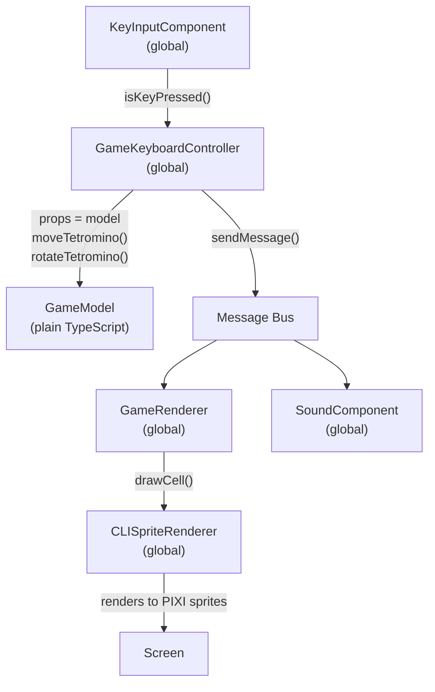
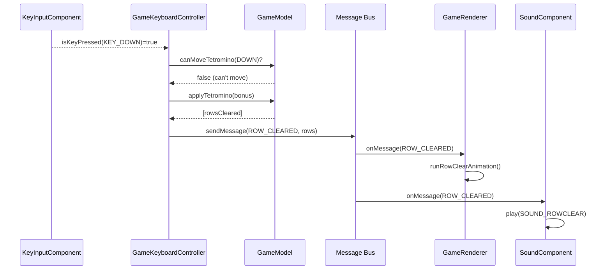

# Tetris — Case Study

> **TL;DR**
> - Tetris is the simplest reference game: no `builders.ts` / `selectors.ts` / `actions.ts` needed because it has no dynamic entity creation or multi-step sequences
> - All game logic lives in `GameModel` — a pure TypeScript class with no ECS dependency
> - `GameController` + `GameKeyboardController` demonstrates the **base class + input subclass** inheritance pattern
> - `SoundComponent` is a pure message listener — the ideal minimal component
> - All four game states (intro, level select, game, highscore) are managed through a single `Factory`

---

## File Structure

```
src/game_tetris/
  index.ts                         # Entry: Tetris extends ECSExample
  constants.ts                     # Assets, Messages, GAME_CONFIG enums
  factory.ts                       # Loads 4 scenes: intro / level-selector / game / highscore
  model/
    game-model.ts                  # Full game state (board, tetromino, score, level)
    score-counter.ts               # Score calculation helper
    shape-generator.ts             # Random permutation tetromino generator
    tetrominos.ts                  # Shape definitions (rotation matrices)
  components/
    game-controller.ts             # Base controller + keyboard subclass
    game-renderer.ts               # CLI-based visual rendering
    sound-component.ts             # Pure message listener for audio
    intro-component.ts             # Animated intro screen (ChainComponent-based)
    level-selector.ts              # Level selection screen
    highscore-saver.ts             # High score entry and display
  cli-renderer/
    cli-renderer-base.ts           # Base class for character-cell rendering
    cli-sprite-renderer.ts         # PIXI sprite-sheet backed CLI renderer
```

---

## Architecture Overview



---

## Factory — Four Scene States

```typescript
export class Factory {
    loadIntro(scene: ECS.Scene) {
        scene.clearScene();
        this.buildGlobalDefaults(scene);    // CLI renderer + KeyInput
        scene.addGlobalComponentAndRun(new IntroComponent());
    }

    loadLevelSelector(scene: ECS.Scene) {
        scene.clearScene();
        this.buildGlobalDefaults(scene);
        scene.addGlobalComponentAndRun(new LevelSelector());
    }

    loadGame(scene: ECS.Scene, level: number = 0) {
        scene.clearScene();
        this.buildGlobalDefaults(scene);
        const model = new GameModel(GAME_COLUMNS, GAME_ROWS, GAME_EXTRA_ROWS, level);
        scene.addGlobalComponentAndRun(new GameKeyboardController(model));
        scene.addGlobalComponentAndRun(new GameRenderer({ model }));
        scene.addGlobalComponentAndRun(new SoundComponent());
    }

    loadHighScoreSaver(scene: ECS.Scene, score: number) {
        scene.clearScene();
        this.buildGlobalDefaults(scene);
        scene.addGlobalComponentAndRun(new HighScoreSaver(score));
    }
}
```

**Pattern observations:**
- Every scene transition calls `clearScene()` first
- `buildGlobalDefaults` is always called — sets up shared infrastructure
- The model (`GameModel`) is passed directly as `props` to the controller and renderer
- There are no visual game objects added to the stage; Tetris renders entirely through the `CLISpriteRenderer` grid

---

## `GameModel` — Pure TypeScript State

`GameModel` is a plain class with no ECS dependency:

```typescript
export class GameModel {
    readonly gameBoard: number[];     // flat array: 0=empty, 1=placed, 2=player
    readonly rows: number;
    readonly columns: number;

    // Getters
    get hasTetromino(): boolean
    get currentScore(): number
    get currentLevel(): number
    get isGameOver(): boolean

    // Commands
    putRandomTetromino(): void        // spawns next piece
    canMoveTetromino(dir: Direction): boolean
    moveTetromino(dir: Direction): void
    canRotate(dir: Direction): boolean
    rotate(dir: Direction): void
    applyTetromino(bonus: number): number[]  // places piece, returns cleared rows
    getStats(): { removedRows, shapesGenerated, nextShape }
}
```

**No `sendMessage` here** — the model is completely passive. Controllers read from it and send messages themselves.

---

## Controller — Inheritance Pattern

Tetris uses a two-level class hierarchy for the controller:

```
ECS.Component<GameModel>
    └── GameController         ← base: game logic, no input awareness
            └── GameKeyboardController  ← adds keyboard polling
```

This allows swapping input methods (keyboard → AI bot → network) without touching game logic:

### `GameController` (base class)

```typescript
export class GameController extends ECS.Component<GameModel> {
    // Internal helpers
    timeWatch: TimeWatcher;
    paused: boolean;

    onInit() {
        this.timeWatch = new TimeWatcher(this.scene);
        this.subscribe(Messages.CONTROLLER_BLOCK, Messages.CONTROLLER_RUN);
    }

    onMessage(msg: ECS.Message) {
        // Block/unblock input
        if (msg.action === Messages.CONTROLLER_RUN)   this.paused = false;
        if (msg.action === Messages.CONTROLLER_BLOCK) this.paused = true;
    }

    onUpdate(delta: number, absolute: number) {
        if (this.paused) return;
        // Auto-advance: drop tetromino over time
        if (this.props.hasTetromino && this.timeWatch.canGameProgress()) {
            this.movePlayer(Direction.DOWN);
        } else if (!this.props.hasTetromino) {
            this.props.putRandomTetromino();
        }
    }

    movePlayer(direction: Direction, speedup = false): boolean {
        // Moves tetromino, handles placement, sends messages
        if (!this.props.canMoveTetromino(Direction.DOWN)) {
            const rows = this.props.applyTetromino(this.moveDownCounter);
            this.sendMessage(rows.length ? Messages.ROW_CLEARED : Messages.TETROMINO_PLACED, rows);
            if (this.props.isGameOver) this.sendMessage(Messages.GAME_OVER);
        } else {
            this.props.moveTetromino(Direction.DOWN);
        }
    }
}
```

### `GameKeyboardController` (input subclass)

```typescript
export class GameKeyboardController extends GameController {
    keyInput: ECS.KeyInputComponent;

    onInit() {
        super.onInit();
        this.keyInput = this.scene.getGlobalAttribute('key_input');
    }

    onUpdate(delta: number, absolute: number) {
        if (this.paused) return;
        if (this.props.isGameOver) {
            if (this.keyInput.isKeyPressed(ECS.Keys.KEY_SPACE)) {
                this.endGame();
                this.finish();
            }
            return;
        }

        // Rotation (one-shot with handleKey)
        if (this.keyInput.isKeyPressed(ECS.Keys.KEY_A)) {
            this.rotatePlayer(Direction.LEFT);
            this.keyInput.handleKey(ECS.Keys.KEY_A);
        }

        // Movement (held keys, time-gated internally)
        if (this.keyInput.isKeyPressed(ECS.Keys.KEY_DOWN)) {
            this.movePlayer(Direction.DOWN, true); // speedup = true for bonus score
        }
        if (this.keyInput.isKeyPressed(ECS.Keys.KEY_LEFT)) {
            this.movePlayer(Direction.LEFT);
        }

        super.onUpdate(delta, absolute); // auto-advance logic
    }
}
```

---

## `GameRenderer` — Message-Driven Redraw

`GameRenderer` does not poll the model every frame. It only redraws when it receives a message:

```typescript
export class GameRenderer extends ECS.Component<{ model: GameModel }> {
    cli: CLISpriteRenderer;

    onInit() {
        this.subscribe(Messages.ROW_CLEARED, Messages.GAME_OVER);
    }

    onAttach() {
        // Initial draw when scene starts
        this.drawFullBoard();
        this.drawStats();
    }

    onMessage(msg: ECS.Message) {
        if (msg.action === Messages.ROW_CLEARED) {
            this.runRowClearAnimation(msg.data as number[]);
        } else if (msg.action === Messages.GAME_OVER) {
            this.runGameOverAnimation();
        }
    }

    onUpdate(delta: number, absolute: number) {
        // Redraws only the cells that can change per frame (active tetromino)
        this.drawGameBoard();
    }
}
```

**Note**: `onUpdate` still runs every frame for the active tetromino rendering, but expensive operations (row clear animation, full board redraw) only happen via messages.

---

## `SoundComponent` — Minimal Message Listener

The ideal example of a single-responsibility component:

```typescript
export class SoundComponent extends ECS.Component {
    onInit() {
        // Subscribe to every game event that triggers sound
        this.subscribe(
            Messages.GAME_OVER, Messages.LEVEL_UP,
            Messages.MOVE_DOWN_BEGIN, Messages.MOVE_DOWN_END,
            Messages.ROW_CLEARED, Messages.TETROMINO_PLACED, Messages.TETROMINO_ROTATED
        );
    }

    onAttach() {
        PIXISound.play(Assets.MUSIC, { loop: true }); // start music when scene loads
    }

    onMessage(msg: ECS.Message) {
        switch (msg.action) {
            case Messages.TETROMINO_ROTATED: PIXISound.play(Assets.SOUND_ROTATE); break;
            case Messages.GAME_OVER:
                PIXISound.stop(Assets.MUSIC);
                PIXISound.play(Assets.SOUND_GAMEOVER);
                break;
            case Messages.ROW_CLEARED: PIXISound.play(Assets.SOUND_ROWCLEAR); break;
            case Messages.TETROMINO_PLACED: PIXISound.play(Assets.SOUND_PLACE); break;
            case Messages.LEVEL_UP: PIXISound.play(Assets.SOUND_LEVELUP); break;
            case Messages.MOVE_DOWN_BEGIN: PIXISound.play(Assets.SOUND_MOVEDOWN, { loop: true }); break;
            case Messages.MOVE_DOWN_END: PIXISound.stop(Assets.SOUND_MOVEDOWN); break;
        }
    }
}
```

**Key design principle**: `SoundComponent` knows nothing about the game model. It only reacts to abstract events.

---

## Message Flow for One Game Tick



---

## `TimeWatcher` — Input Rate Limiting

Tetris implements custom time-based rate limiting for smooth input. This is done outside ECS (it's a plain helper class) to keep timing logic contained:

```typescript
class TimeWatcher {
    canMoveAside(): boolean {
        // First press: immediate
        // Held: first repeat after 200ms, subsequent repeats after 50ms
    }

    canMoveDown(): boolean {
        // Manual down: no faster than every 30ms
    }

    canGameProgress(): boolean {
        // Auto-drop: based on level * speedMultiplier
    }
}
```

This is an example of a **helper class** that belongs in the component, not in the model.
