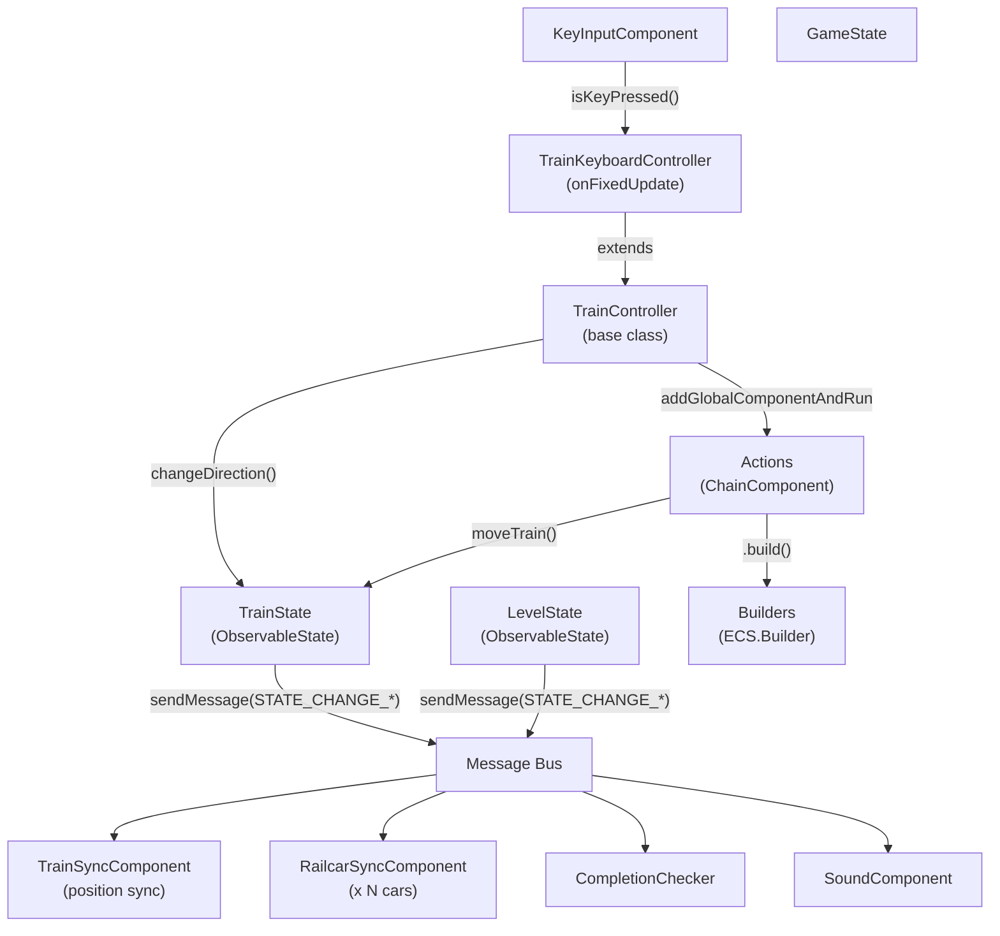
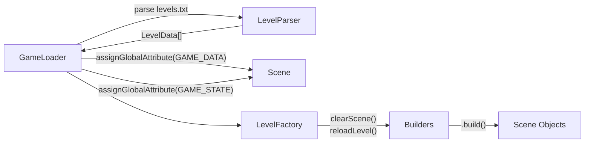
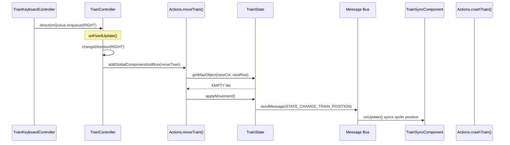

# Vlak — Case Study

> **TL;DR**
> - Vlak is the most architecturally complete reference game: it uses all five patterns (Factory, Builders, Selectors, Actions, ObservableState)
> - State classes (`TrainState`, `LevelState`, `GameState`) extend `ObservableState` — they send messages on mutation, making them reactive
> - `Actions` contains all multi-step game sequences as `ChainComponent` factories — no game logic in components themselves
> - `TrainSyncComponent` and `RailcarSyncComponent` demonstrate the sync-component pattern: state drives position, component just syncs display
> - Level loading is fully separated: `GameLoader` → `LevelFactory` → `Builders`

---

## File Structure

```
src/game_vlak/
  index.ts                     # Entry: Vlak extends ECSExample
  constants.ts                 # Assets, Messages, Tags, Attributes enums
  builders.ts                  # Builder factory functions for all entities
  selectors.ts                 # Typed getGlobalAttribute wrappers
  actions.ts                   # ChainComponent factories for game sequences
  helpers.ts                   # Pure utility functions (direction math, texture offsets)
  model/
    game-structs.ts            # Immutable data types (LevelData, MapObject, Direction…)
    state-structs.ts           # Mutable state: TrainState, LevelState, GameState
  components/
    train-controller.ts        # Base controller: fixed-update movement loop
    train-keyboard-controller.ts # Input subclass
    train-sync-component.ts    # Syncs sprite to TrainState (direction + wheel animation)
    railcar-sync-component.ts  # Syncs each car sprite to its CarState
    completion-checker.ts      # Detects level completion
    score-counter.ts           # Message-driven score tracking
    sound-component.ts         # Message-driven audio
    password-component.ts      # Level password entry UI
    wait-input-component.ts    # ChainComponent helper: waits for any key press
  animators/
    train-crash-animator.ts    # ChainComponent-based crash animation
    door-animator.ts           # Door open animation
    item-animator.ts           # Item pickup sparkle animation
    wallfade-animator.ts       # Level transition fade
  loaders/
    game-loader.ts             # Assets loading + data bootstrap
    level-parser.ts            # Text file → LevelData
    level-factory.ts           # Scene setup for each level
```

---

## Architecture Overview



---

## ObservableState Pattern

This is the most distinctive pattern in Vlak. State objects extend `ObservableState`, gaining the ability to send messages on mutation:

```typescript
class ObservableState {
    protected scene: ECS.Scene;

    public sendMessage(type: Messages, data?: any) {
        this.scene.sendMessage(new ECS.Message(type, null, null, data));
    }
}
```

State mutations automatically broadcast events — no component needs to manually send messages:

```typescript
export class TrainState extends ObservableState {
    changeDirection(direction: Direction) {
        this._position = { ...this._position, direction };
        this.sendMessage(Messages.STATE_CHANGE_TRAIN_DIRECTION, direction);
    }

    applyMovement() {
        // ... update positions ...
        this.sendMessage(Messages.STATE_CHANGE_TRAIN_POSITION, this._position);
    }

    crashTrain() {
        this._crashed = true;
        this.sendMessage(Messages.STATE_CHANGE_TRAIN_CRASHED);
    }
}

export class LevelState extends ObservableState {
    pickItem(column: number, row: number) {
        // ... update internal map ...
        this.sendMessage(Messages.STATE_CHANGE_ITEM_PICKED, oldItem);
    }

    openDoor() {
        this._doorOpen = true;
        this.sendMessage(Messages.STATE_CHANGE_DOOR_OPEN, true);
    }
}
```

---

## `Selectors` — Global State Access

```typescript
export class Selectors {
    static gameStateSelector = (scene: ECS.Scene) =>
        scene.getGlobalAttribute<GameState>(Attributes.GAME_STATE);

    static gameDataSelector = (scene: ECS.Scene) =>
        scene.getGlobalAttribute<GameData>(Attributes.GAME_DATA);
}

// Usage in any component or action:
const state = Selectors.gameStateSelector(this.scene);
const level = state.currentLevel;
const train = level.trainState;
```

---

## `Actions` — ChainComponent Sequences

`Actions` is a static class of factory functions returning `ChainComponent` instances. None of them contain PIXI manipulation — that's delegated to `Builders`. None of them contain state checks — that's delegated to `Selectors`.

### `moveTrain`

The most complex action: moves the train, handles collision detection, picks up items, or crashes:

```typescript
static moveTrain = (scene: ECS.Scene, trainState: TrainState) => {
    const { x, y } = dirToCoordIncrement(trainState.position.direction);
    const newCol = trainState.position.column + x;
    const newRow = trainState.position.row + y;
    const levelState = Selectors.gameStateSelector(scene).currentLevel;
    const target = levelState.getMapObject(newCol, newRow);

    if (target.type === ObjectTypes.WALL || 
        (target.type === ObjectTypes.DOOR && !levelState.doorOpen)) {
        return Actions.crashTrain(scene, trainState); // returns a crash ChainComponent
    }

    return new ECS.ChainComponent()
        .call(() => {
            if (target.isItem) {
                levelState.pickItem(newCol, newRow);
                const newCar = trainState.addItemToTail(target.type);
                Builders.trainCarBuilder(scene, newCar).build();
            }
            trainState.applyMovement();
            const trainSprite = scene.findObjectByTag(Tags.TRAIN);
            trainSprite.position.set(newCol * SPRITE_SIZE, newRow * SPRITE_SIZE);
        });
}
```

### `crashTrain`

Plays crash animation and reloads the level:

```typescript
static crashTrain = (scene: ECS.Scene, trainState: TrainState) => {
    return new ECS.ChainComponent()
        .call(() => {
            trainState.crashTrain(); // sends STATE_CHANGE_TRAIN_CRASHED → sync components finish()
            scene.findObjectByTag(Tags.TRAIN).addComponent(new TrainCrashAnimator());
        })
        .waitTime(2000)
        .call(() => scene.callWithDelay(0, () => LevelFactory.reloadLevel(scene)));
}
```

### `loadNextLevel`

Handles both "next level" and "game complete" cases by dynamically extending the chain:

```typescript
static loadNextLevel = (scene: ECS.Scene, delay = 1000) => {
    return new ECS.ChainComponent()
        .waitTime(delay)
        .waitFor(Actions.wallFade(scene, 'fadein'))
        .call((cmp) => {
            const gameState = Selectors.gameStateSelector(scene);
            if (gameState.currentLevelIndex === gameState.gameData.levels.length - 1) {
                cmp.mergeWith(new ECS.ChainComponent()
                    .call(() => Builders.endInfoBuilder(scene).build())
                    .waitFor(() => new WaitInputComponent())
                    .call(() => scene.callWithDelay(0, () => LevelFactory.loadIntro(scene)))
                );
            } else {
                cmp.mergeWith(new ECS.ChainComponent()
                    .call(() => scene.callWithDelay(0, () =>
                        LevelFactory.loadLevel(scene, gameState.currentLevelIndex + 1)))
                );
            }
        });
}
```

---

## Train Controller — Fixed-Update Architecture

The train moves on a fixed schedule (3 ticks/second by default):

```typescript
export class TrainController extends ECS.Component<TrainState> {
    protected directionQueue: Queue<Direction> = new Queue();
    protected isActive = false;

    onInit() {
        this.subscribe(Messages.LEVEL_COMPLETED, Messages.STATE_CHANGE_TRAIN_CRASHED);
        this.fixedFrequency = 3 * GAME_SPEED;
    }

    onFixedUpdate() {
        if (!this.isActive) return;
        if (!this.directionQueue.isEmpty()) {
            this.changeDirection(this.directionQueue.dequeue());
        }
        this.moveForward(); // delegates to Actions.moveTrain
    }

    onMessage(msg: ECS.Message) {
        if (msg.action === Messages.LEVEL_COMPLETED ||
            msg.action === Messages.STATE_CHANGE_TRAIN_CRASHED) {
            this.finish(); // stop processing
        }
    }

    moveForward() {
        // Creates and immediately runs a ChainComponent action
        this.scene.addGlobalComponentAndRun(
            Actions.moveTrain(this.scene, this.props)
        );
    }
}
```

The keyboard subclass adds direction input to the queue:

```typescript
export class TrainKeyboardController extends TrainController {
    onInit() {
        super.onInit();
        this.isActive = false; // wait for first key press
    }

    onFixedUpdate() {
        const keys = this.scene.getGlobalAttribute<ECS.KeyInputComponent>(Attributes.KEY_INPUT);
        if (keys.isKeyPressed(ECS.Keys.KEY_UP)) {
            this.directionQueue.enqueue(Direction.UP);
            this.isActive = true;
        }
        // ... other directions ...
        super.onFixedUpdate();
    }
}
```

---

## Sync Components

Two sync components keep the display in sync with state:

### `TrainSyncComponent`

Tracks the train sprite's position, direction, and wheel animation frame:

```typescript
export class TrainSyncComponent extends ECS.Component<TrainState> {
    currentFrame = 0;

    onInit() {
        this.subscribe(Messages.STATE_CHANGE_TRAIN_CRASHED);
        this.fixedFrequency = ANIM_FREQUENCY; // wheel animation tick
    }

    onMessage(msg: ECS.Message) {
        if (msg.action === Messages.STATE_CHANGE_TRAIN_CRASHED) {
            this.finish(); // stop animating when crashed
        }
    }

    onFixedUpdate() {
        this.currentFrame = (this.currentFrame + 1) % 3; // cycle wheel frames
    }

    onUpdate() {
        // Update texture frame based on direction + animation frame
        this.syncState();
    }
}
```

### `RailcarSyncComponent`

One instance per car — simply syncs position from `CarState`:

```typescript
export class RailcarSyncComponent extends ECS.Component<CarState> {
    onUpdate(delta: number, absolute: number) {
        this.owner.position.set(
            this.props.position.column * SPRITE_SIZE,
            this.props.position.row * SPRITE_SIZE
        );
    }
}
```

---

## Level Loading Pipeline



1. **`GameLoader`**: loads assets, calls `LevelParser`, stores `GameData` and `GameState` as global attributes, then delegates to `LevelFactory.loadIntro(scene)`
2. **`LevelParser`**: parses the text level file into `LevelData[]` — pure data transformation, no ECS
3. **`LevelFactory`**: all static methods — orchestrates scene reloads using `Builders` and `Actions`
4. **`Builders`**: returns `ECS.Builder` instances — constructs all entities (train, cars, tiles, HUD, text)

---

## Message Flow for One Movement Step



---

## `CompletionChecker`

Listens for item pickup events and opens the door when all items are collected:

```typescript
export class CompletionChecker extends ECS.Component {
    onInit() {
        this.subscribe(Messages.STATE_CHANGE_ITEM_PICKED);
    }

    onMessage(msg: ECS.Message) {
        if (msg.action === Messages.STATE_CHANGE_ITEM_PICKED) {
            const levelState = Selectors.gameStateSelector(this.scene).currentLevel;
            if (levelState.allItemsPicked()) {
                // Open the door via an Action
                this.scene.addGlobalComponentAndRun(Actions.openDoor(this.scene));
            }
        }
    }
}
```

This illustrates the **event chain**: `pickItem()` → `STATE_CHANGE_ITEM_PICKED` message → `CompletionChecker` → `Actions.openDoor()` → `LevelState.openDoor()` → `STATE_CHANGE_DOOR_OPEN` message → door animator.
